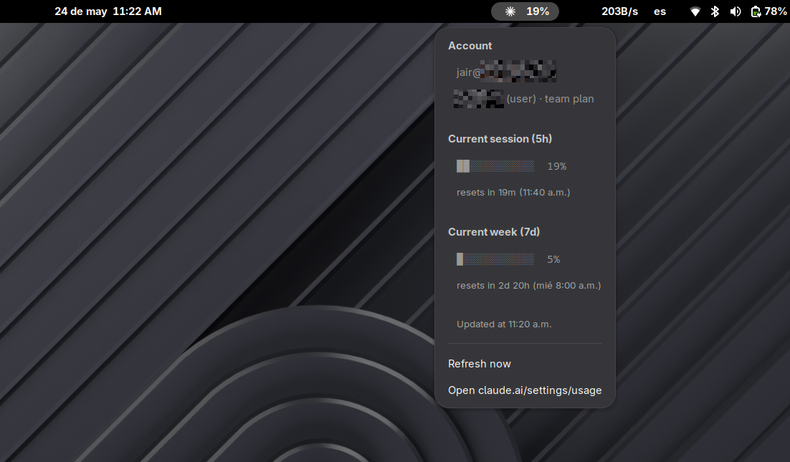

# Claude Meter

A small GNOME Shell extension that shows your Claude usage (5-hour and weekly
quota windows) in the top bar. Click the indicator for the per-window
breakdown or to jump to `claude.ai/settings/usage`.



The label changes color as you approach your limits:

| Highest window | Color |
|---|---|
| < 60% | white |
| 60–79% | yellow |
| 80–89% | orange |
| ≥ 90% | red |

## Requirements

- GNOME Shell 49 (declared in `metadata.json`; should work on neighbouring
  versions with a small bump)
- Claude Code installed and logged in. The extension reads two files from
  your home directory:
  - `~/.claude/.credentials.json` — OAuth access token (used as a Bearer
    token), `expiresAt` (a local pre-flight check so we skip the HTTP call
    when the token is already expired), plus the `subscriptionType` and
    `rateLimitTier` fields shown in the popup. Other fields in this file
    (including `refreshToken`) are never read.
  - `~/.claude.json` — the `oauthAccount` subtree only, for `emailAddress`,
    `displayName`, `organizationName`, and `organizationRole` shown in the
    popup. The rest of this file (project history, growth-book features,
    UI state) is parsed but never read past the `oauthAccount` key.

  It calls a single endpoint:
  ```
  GET https://api.anthropic.com/api/oauth/usage
  Authorization: Bearer <token>
  anthropic-beta: oauth-2025-04-20
  ```

No other secrets are read, no other URLs are contacted, no shell commands are
executed. See `client.js` — it is the only file that touches the network or
filesystem.

## Your credentials are never modified

This extension is **strictly read-only** with respect to your Claude data. It
**opens the credential files for reading only and never writes, edits, moves,
deletes, or re-saves them** — `~/.claude/.credentials.json` and `~/.claude.json`
are left byte-for-byte untouched. It does not:

- write, rotate, or refresh your token (the `refreshToken` is never even read);
- modify any file under `~/.claude/` or anywhere else on your system;
- send your token, email, or any account data to any server other than
  `api.anthropic.com` — the same host Claude Code itself uses;
- run shell commands, `eval`, or any remote code.

Because nothing is ever written back, the extension **cannot corrupt your login,
log you out, or change anything about your account or usage**. The worst it can
do is read a couple of fields and show a number in your top bar. If you want to
verify this, every read and the single network call live in `client.js` — it is
deliberately the only file that touches your data or the network.

## Install (development, from this checkout)

```bash
./install.sh
# log out / log in (Wayland) so the shell picks up the new extension
gnome-extensions enable claude-meter@jairhdez
```

`install.sh` symlinks this directory into
`~/.local/share/gnome-shell/extensions/claude-meter@jairhdez`, so edits in the
repo are picked up after a shell reload — no copying back and forth.

## Uninstall

```bash
gnome-extensions disable claude-meter@jairhdez
rm ~/.local/share/gnome-shell/extensions/claude-meter@jairhdez
```

## Why this exists

`/usage` inside Claude Code already shows the same numbers, but only when you
have a session open. This extension keeps the same number visible in the panel
all day so you notice quota pressure before it bites.

## Layout

```
extension.js     Top-bar indicator, menu, refresh timer
client.js        OAuth token + account-identity reads + single HTTP GET against the Anthropic API
stylesheet.css   Colors for the four label states
metadata.json    UUID, shell-version, etc.
install.sh       Symlinks this dir into ~/.local/share/gnome-shell/extensions/
```

## License

GPL-3.0-or-later — see `LICENSE`.

## Disclaimer

This is an unofficial, community-built tool. Not affiliated with, endorsed by,
or sponsored by Anthropic. "Claude" is a trademark of Anthropic PBC; it is used
here in a nominative, descriptive sense to identify the service this extension
connects to.
